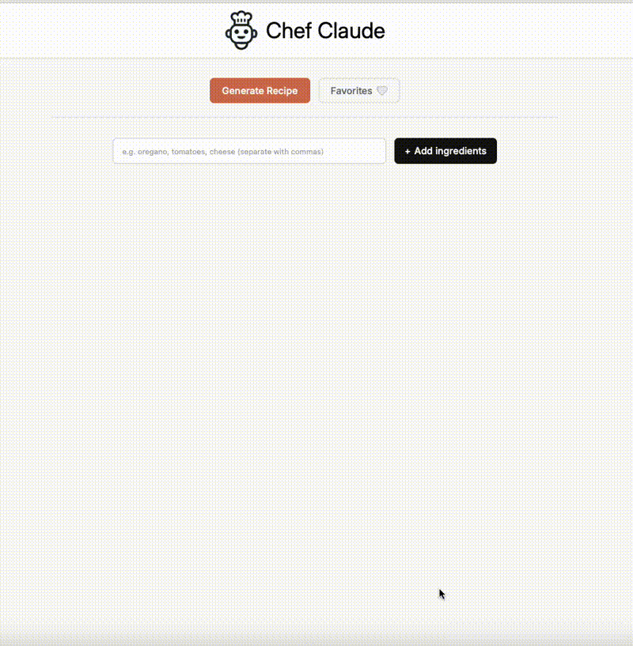

# Chef Claude - AI Recipe Generator with Nutrition

An intelligent recipe generator that creates personalized recipes based on your available ingredients, powered by Claude AI and enhanced with comprehensive nutritional information from the USDA FoodData Central API.



## ✨ Features

- 🍳 **Smart Recipe Generation** - Enter your available ingredients and get creative, personalized recipes
- 📊 **Detailed Nutrition Facts** - Complete nutritional breakdown per serving using USDA data
- ❤️ **Save Favorites** - Bookmark recipes with full nutrition data for easy access
- 📱 **Responsive Design** - Seamless experience on mobile, tablet, and desktop
- ⚡ **Parallel Processing** - Recipe and nutrition data fetched simultaneously for fast results
- 🔒 **Secure Architecture** - API keys properly secured with serverless functions

## 🚀 Live Demo

[**Try Chef Claude**](https://your-ai-chef.netlify.app/)

## 🛠️ Tech Stack

- **Frontend**: React 18, Vite
- **AI**: Anthropic Claude API 
- **Nutrition Data**: USDA FoodData Central API
- **Deployment**: Netlify with serverless functions
- **Storage**: Local storage for favorites
- **Styling**: Custom CSS with responsive design

## 🏗️ Architecture

- **Frontend → Netlify Function**: Secure Claude AI recipe generation
- **Frontend → USDA API**: Direct nutritional data fetching (public API)
- **Component-based**: Reusable UI components with clean separation of concerns

## 🎯 How It Works

1. **Add Ingredients** - Enter 4+ ingredients you have available
2. **Generate Recipe** - Claude AI creates a personalized recipe
3. **Get Nutrition** - USDA API provides detailed nutritional breakdown
4. **Save Favorites** - Bookmark recipes with nutrition data for later

## 📊 Nutrition Features

- Calories, macronutrients (protein, carbs, fat)
- Micronutrients (fiber, sodium, vitamins, minerals)
- Per-serving calculations (default: 4 servings)
- Data sourced from USDA FoodData Central

## 🔧 Development

### Prerequisites
- Node.js 16+
- Netlify account
- Anthropic API key
- USDA API key (free from data.gov)

### Local Setup

```bash
# Clone repository
git clone https://github.com/tourank/chef-claude.git
cd chef-claude

# Install dependencies
npm install

# Create environment file
echo "ANTHROPIC_API_KEY=your_anthropic_key" > .env
echo "VITE_USDA_API_KEY=your_usda_key" >> .env

# Start development server
npm run dev
```

### Deployment

1. Deploy to Netlify
2. Set environment variables:
   - `ANTHROPIC_API_KEY` (for serverless function)
   - `VITE_USDA_API_KEY` (for frontend build)

## 🔐 Security

- **Anthropic API key**: Secured in Netlify serverless function
- **USDA API key**: Safe for client-side use (public, rate-limited API)
- **No sensitive data exposure**: Proper separation of public/private APIs

## 🎨 Key Components

- `ClaudeRecipe.jsx` - Recipe display with favorites functionality
- `NutritionInfo.jsx` - Nutritional data visualization
- `HeartIcon.jsx` - Reusable favorite button component
- `utils/favorites.js` - Centralized localStorage operations
- `usda-api.js` - USDA API integration and nutrition calculations

## 📝 License

MIT License - feel free to use and modify!


---
